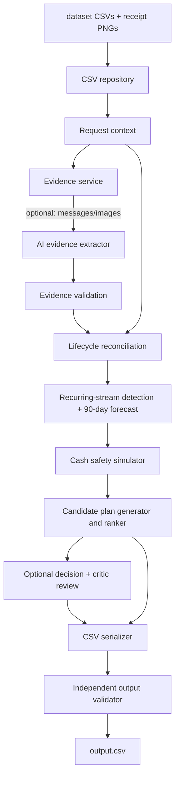

# Buy or Wait? — Financial Decision Agent

This repository contains a production-oriented submission for HackerRank Orchestrate’s **Buy or Wait?** challenge. For every row in `dataset/requests.csv`, it reconstructs the requester’s conservative cash position and recommends whether to pay in full, pay partially, use a supplied installment plan, wait, or decline the request.

The financial core is deterministic. An optional AI layer can extract facts from messages and receipt images and choose only from pre-computed, simulator-safe candidates; it cannot invent balances, payment terms, or plans.

## Output

The production run writes one row per request to `output.csv` with this exact schema:

```text
request_id,amount_safe_to_pay,affordability_status,recommended_payment_method,payment_plan,earliest_date_for_full_payment,spending_changes_needed,decision_explanation
```

`amount_safe_to_pay` is the maximum immediate amount that remains safe under the 90-day forecast before optional spending changes. All monetary calculations use `Decimal`, not binary floating point.

## Architecture



### Components

| Area | Location | Responsibility |
|---|---|---|
| Entry point | `code/main.py` | Loads configuration, runs each request, checkpoints rows, and validates the final file. |
| Application | `code/buywait/application.py` | Builds request contexts and exposes decision, forecast, evidence, and correction use cases. |
| Adapters | `code/buywait/adapters/` | Strict CSV ingestion, dated FX conversion, and evidence caching. |
| Evidence | `code/buywait/evidence.py`, `evidence_validation.py` | Associates messages/images with a request and rejects unsupported or malformed facts. |
| Reconciliation | `code/buywait/reconciliation.py` | Resolves cancellation, amendment, settlement, duplicate lifecycle, and internal-transfer state. |
| Forecasting | `code/buywait/recurrence.py`, `core.py` | Detects stable recurring streams, reserves protected variable spending, and simulates 90 days. |
| AI review | `code/agent/` | Optional evidence extraction and candidate review through read-only tools. |
| Validation | `code/evaluation/output_validation.py` | Recomputes constraints and rejects malformed, unsafe, or inconsistent output. |

## Decision lifecycle

1. **Ingest data.** CSV adapters reject duplicate IDs, invalid links, and cross-user lifecycle/evidence references.
2. **Build context.** A request is joined to its profile, payment options, events, messages, and relevant images.
3. **Resolve evidence safely.** Messages and images are evidence, never instructions. Extracted facts must be supported by the source before altering the ledger.
4. **Reconcile events.** Failed, cancelled, unrealized, duplicate, and internal-transfer records are handled correctly. Pending debits are reserved; pending credits are excluded.
5. **Forecast commitments.** Stable history drives recurring salary and expenses. Protected variable spending can form conservative weekly/monthly reserves without double counting named streams.
6. **Simulate safety.** Events and candidate payments are applied in settlement-date order for 90 days. The balance must never fall below the user’s minimum.
7. **Select a plan.** The engine evaluates full payment, eligible partial payment, offered installments, wait, and permitted flexible-expense changes. Ranking prioritizes deadline completion, no changes, lowest total cost, earlier start, fewer payments, then payment-option ID.
8. **Serialize and validate.** Output preserves request order and exact columns. The independent validator checks every amount, schedule, preference, and safety condition.

## Financial rules enforced

- Uses only dated rates from `dataset/exchange_rates.csv`.
- Does not treat pending credits, unapproved bonuses/commissions, refunds in processing, or unrealized investments as spendable cash.
- Reserves pending debits, including stale pending debits at the request boundary.
- Counts confirmed income on its settlement date.
- Does not infer recurrence from irregular or insufficient history.
- Restricts spending changes to recurring, non-protected categories allowed by the profile.
- Requires installment schedules to exactly match a supplied option and respect the user’s installment-month limit.
- Requires exactly two partial-payment entries that add to the requested amount and complete by the requested date.
- Produces deterministic financial decisions for the same dataset and evidence facts.

## Repository layout

```text
.
├── code/
│   ├── main.py                    # Production entry point
│   ├── buywait/                   # Domain, reconciliation, forecasting, decisions
│   ├── agent/                     # Optional model-based evidence/review layer
│   ├── evaluation/                # Validation, sample regression, usage report
│   ├── tests/                     # Unit, integration, output, and agent-contract tests
│   └── tools/server.py            # Read-only tools exposed to optional AI review
├── dataset/
│   ├── requests.csv               # Evaluation requests
│   ├── financial_profiles.csv
│   ├── financial_events.csv
│   ├── exchange_rates.csv
│   ├── request_payment_options.csv
│   ├── messages.csv
│   ├── images.csv
│   └── media/images/*.png
├── output.csv                     # Generated submission artifact
├── requirements.txt
└── AGENTS.md                      # Repository operating rules
```

## Setup

### Prerequisites

- Python 3.11 or newer
- `pip`

Create and activate a virtual environment:

```bash
python -m venv .venv
```

Windows PowerShell:

```powershell
.\.venv\Scripts\Activate.ps1
python -m pip install --upgrade pip
python -m pip install -r requirements.txt
```

macOS/Linux:

```bash
source .venv/bin/activate
python -m pip install --upgrade pip
python -m pip install -r requirements.txt
```

## Run the production pipeline

Run commands from the repository root.

### Deterministic mode

This mode makes no model calls. It reads the dataset, runs the financial core, writes `output.csv`, and validates it before completion.

```bash
python code/main.py --no-ai --output output.csv
```

Expected final line:

```text
wrote and validated 250 rows to output.csv
```

### AI-assisted evidence mode

Use this mode when an OpenAI-compatible provider is configured and message/receipt extraction is required. The model receives relevant source evidence, but it can only select among deterministic, simulator-safe candidates.

Create `.env` from the example, configure it, and never commit it:

```powershell
Copy-Item .env.example .env
```

Minimum settings:

```dotenv
AI_MODE=enabled
OPENAI_API_KEY=replace_me
OPENAI_VISION_ENABLED=true
```

Then run:

```bash
python code/main.py --require-ai --output output.csv
```

`--require-ai` fails closed if credentials or vision support are unavailable. A malformed decision or critic response is retried up to `AGENT_MAX_DECISION_RETRIES` times (default: 2); if every retry is malformed, that request uses the deterministic decision instead.

### AI watch mode

An AI-enabled run stays alive after its initial batch is validated. It polls `dataset/requests.csv` for append-only rows and immediately processes each new request, atomically republishes `output.csv`, and continues waiting. The default interval is five seconds; configure `REQUESTS_POLL_SECONDS` in `.env` or override it on the command line.

```bash
python code/main.py --require-ai --poll-interval 10
```

Use `--no-watch` for a one-shot AI run. `--watch` also enables this behavior explicitly for a deterministic run. Existing request IDs must not be edited, deleted, or reordered while watching; only complete new rows may be appended.

## Validate output

Always validate before packaging a submission:

```bash
python code/evaluation/output_validation.py --output output.csv --dataset dataset
```

The validator checks exact schema/order, one row per request, amount bounds, baseline consistency, method eligibility, payment dates/totals, provider-option matches, spending-change legality, and 90-day safety.

## Test suite

Windows PowerShell:

```powershell
$env:PYTHONPATH = "code"
python -m unittest discover -s code/tests -v
```

macOS/Linux:

```bash
PYTHONPATH=code python -m unittest discover -s code/tests -v
```

Run public sample regression:

```bash
python code/evaluation/main.py --samples
```

## Operating notes

### Checkpointing and atomic finalization

`code/main.py` writes a checkpoint after every request to `output.csv.tmp`. It validates the complete temporary file before atomically replacing `output.csv`, so a reader never sees a partial final submission. If a run is interrupted, rerun it; never submit the temporary checkpoint.

### Evidence cache

Evidence extraction can be cached in `dataset/.evidence_cache.json` to avoid repeated provider calls. The cache is treated as untrusted input: malformed, stale, unsupported, or missing-image facts are discarded.

### Usage report

AI-enabled production runs write `code/evaluation/usage_report.md`, recording actual model calls, token counts, and optional cost estimates. Include this file in the submitted `code.zip`.

